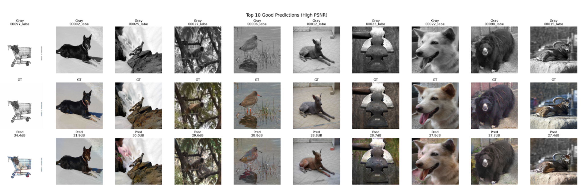
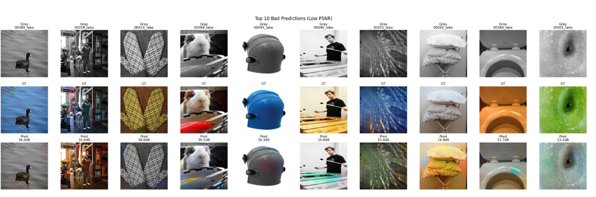
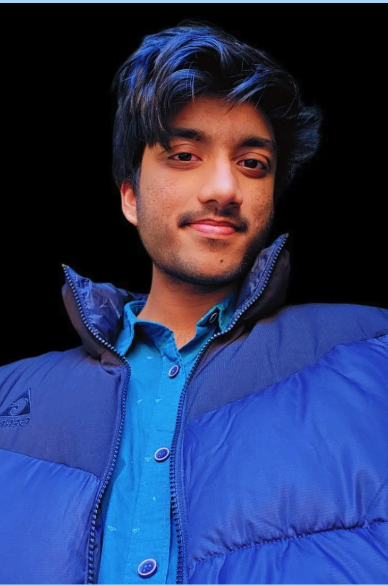
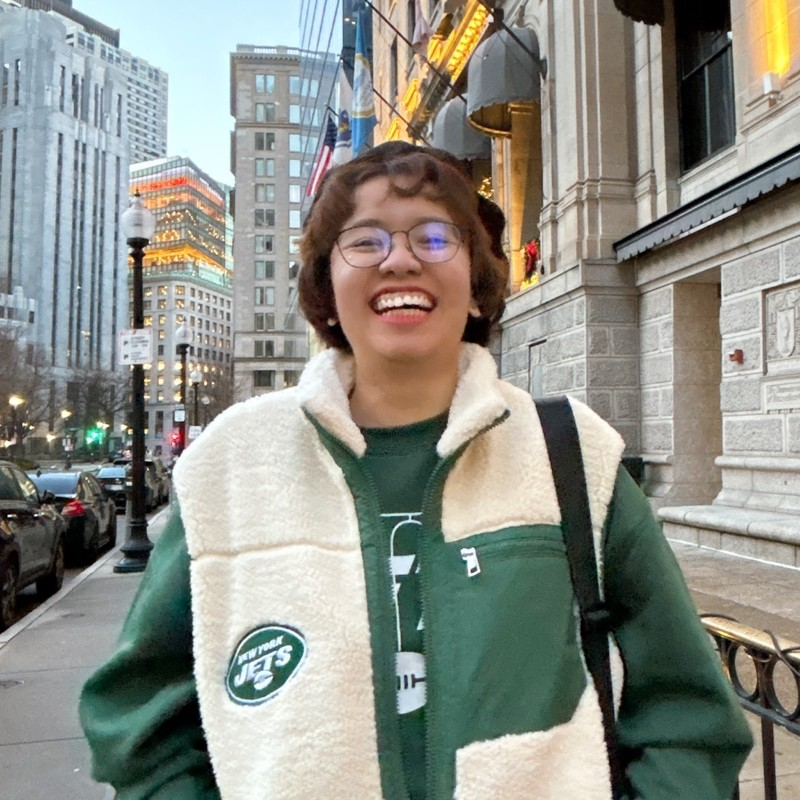

# <h1 align="center">  🟦 Enhancing Image Colorization Using Conditional GANs

<em>Bring grayscale images to life with deep learning!</em>

## <h2 align="center"> 🟦 What’s This Project About?

Our project transforms black-and-white images into vibrant, colorized versions using a **Conditional Generative Adversarial Network (cGAN)**. We combine a **ResNet18 encoder**, **Dynamic UNet decoder**, and **PatchGAN discriminator** to learn realistic mappings from grayscale to color. Our work automates a process that once required manual skill — making it instant, scalable, and accessible.

  <a href="Image_Colorization_Avanith_Rami_Pranathi.pdf" target="_blank">View our paper</a> |
  <a href="https://docs.google.com/presentation/d/1ugwfzaby_SkdIb8dxpUI79GYZOD1xhxJ/edit?usp=sharing&ouid=117579044537130000857&rtpof=true&sd=true" target="_blank">Presentation</a>

## <h2 align="center"> 🟦 Problem & Solution

### Problem

Grayscale images are emotionally powerful, but lack visual richness. Manual recoloring is slow, costly, and inconsistent.

### Solution

We train a deep learning model to **learn color patterns from real-world images** and apply them to black-and-white inputs — offering fast, accurate, and beautiful colorization.

## <h2 align="center"> 🟦 Real-World Applications

- Revive old family photos  
- Recolor historic archives  
- Help artists and content creators  
- Restore vintage films  
- Create colorful educational materials

---

## <h2 align="center"> 🟦 Model Architecture

    - Encoder: ResNet18 (pretrained)
    - Decoder: Dynamic UNet
    - Discriminator: 70x70 PatchGAN
    - Loss: L1 Loss + GAN Loss
    - Image Size: 256x256

## <h2 align="center"> 🟦 Training Information

| **Setting**        | **Details**                        |
|--------------------|------------------------------------|
| Dataset            | Subset of ImageNet (~10k images)   |
| Libraries          | PyTorch, FastAI, OpenCV, NumPy     |
| Training Time      | ~10 hours                          |
| Optimizer          | Adam (β₁ = 0.5, β₂ = 0.999)         |
| Evaluation Metrics | MSE, SSIM, Visual Comparison       |

---

  
   <em>Top 10 good predictions based on Peak Signal-to-Noise Ratio Metric </em>

  
   <em>Top 10 worse predictions based on Peak Signal-to-Noise Ratio Metric </em>

## <h2 align="center"> 🟦 Future Improvements

- Real-time demo  
- Mobile + web support  
- Adjustable color warmth/vibrancy  
- Add Vision Transformers + Diffusion models  
- Tune for specific photo types (portraits, landscapes)

## <h2 align="center"> 🟦 Meet the Team

<table>
<td align="center">
  <a href="https://www.linkedin.com/in/avanith-kanamarlapudi-8aa081204/">
     
    <strong>Avanith Kanamarlapudi</strong>
  </a>
</td>
<td align="center">
  <a href="https://www.linkedin.com/in/raminguyen/">
     
    <strong>Rami Huu Nguyen</strong>
  </a>
</td>
<td align="center">
  <a href="https://www.linkedin.com/in/lakshmi-pranathi-vutla30/">
     
    <strong>Lakshmi Pranathi Vutla</strong>
  </a>
</td>

</table>

## <h2 align="center"> Acknowledgements

#UMassBoston #ImageColorization #DeepLearning #CGAN #Rami #Avanith #Pranathi

